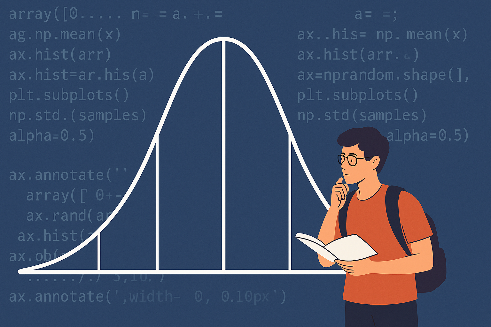

# Applied Statistics
**Author:** Marcella Morgan
**Image Credit:** Images generated with the help of ChatGPT (OpenAI).



This is the repository for my project for the Applied Statistics module of the [Higher Diploma in Science in Data Analytics given by ATU Galway-Mayo](https://www.gmit.ie/higher-diploma-in-science-in-computing-in-data-analytics). My lecturer was [Ian McLoughlin](https://github.com/ianmcloughlin).

This repository contains a small simulation-based project exploring how common statistical methods behave in practice. Rather than focusing on formal proofs, the project uses code and repeated random experiments to show how ideas like probability, distributions, hypothesis testing, and error rates actually play out in data. The examples highlight where statistical tests work well, where they can fail, and how design choices such as sample size, effect size, and test selection influence results.

## Getting Started

To get started with this repository, you’ll need:  
1. **Python**: Install Python (I recommend using [Anaconda](https://www.anaconda.com/), which includes all the necessary tools and libraries).  
2. **A Notebook Editor**: I used Visual Studio Code, but you can also use [Jupyter Notebook](https://jupyter.org/) or [Google Colab](https://colab.research.google.com/).  

## Libraries Used

Mathematical functions from the standard library.
https://docs.python.org/3/library/math.html
import math

Random selections.
https://docs.python.org/3/library/random.html
import random

Numerical structures and operations.
https://numpy.org/doc/stable/reference/index.html#reference
import numpy as np

Plotting.
https://matplotlib.org/stable/contents.html
import matplotlib.pyplot as plt

Random selections.
https://docs.python.org/3/library/random.html
import random

Statistics.
import scipy.stats as stats

Data frames.
import pandas as pd


A `requirements.txt` file is included in the root of the repository. It lists all the Python dependencies needed to run this project.

To install the dependencies, follow these steps:

1. Ensure you have Python and pip installed on your system.
2. Navigate to the project directory in your terminal.
3. Run the following command to install all the required packages:

```bash
pip install -r requirements.txt
```

## Problem 1 Lady Testing Tea:

This problem plays with the famous Lady Tasting Tea experiment, where instead of 8 cups (4 tea-first, 4 milk-first), we now prepare 12 cups (8 tea-first, 4 milk-first). A participant claims they can identify which pouring order was used. Using numpy, we simulate the experiment by shuffling the cups and calculating the probability of correctly identifying all cups by chance. We then compare this probability with the original 8-cup experiment and discuss whether the statistical significance threshold (p-value) might reasonably be adjusted for the larger design.


## Problem 2 Standard Deviation:

Here, we explore the difference between sample standard deviation (ddof=1) and population standard deviation (ddof=0). We generate 100,000 samples of size 10 from the standard normal distribution and compute both standard deviations for each sample. By plotting the two sets of results on the same axes, we can visually compare the distributions and see how the correction for sample size affects variability. Finally, we consider how these differences are expected to change if the sample size is increased, connecting the simulation to statistical theory.


## Problem 3: t-Tests and Type II Errors

This problem focuses on type II error rates in hypothesis testing. We vary the difference in means (d = 0 to 1.0) between two normal distributions (sample size = 100 each). For each scenario, we simulate 1,000 independent t-tests, recording the proportion of times the null hypothesis is not rejected (type II error). Plotting these error rates against the mean differences illustrates how the probability of failing to detect a real effect declines as the true difference increases. This exercise emphasizes the relationship between effect size, sample size, and statistical power.


## Problem 4: ANOVA vs t-Tests

The goal here is to compare ANOVA with multiple independent t-tests when analyzing differences across more than two groups. We generate three normal samples of size 30 each, with means 0, 0.5, and 1. After performing a one-way ANOVA, we also run three pairwise t-tests (group 1 vs 2, 1 vs 3, 2 vs 3). The results are compared, highlighting how ANOVA efficiently tests for differences across all groups simultaneously, avoiding the inflation of type I error that arises when running multiple t-tests independently.


## Getting Help
If you have questions about this repository or the project, feel free to contact me at [contactmarcellamorgan@gmail.com](mailto:contactmarcellamorgan@gmail.com). Alternatively, you can submit an issue via GitHub issues.

## Resources

### GENERAL STATISTICAL CONCEPTS

Null hypothesis
https://www.investopedia.com/terms/n/null_hypothesis.asp

P-value overview
https://www.dummies.com/article/academics-the-arts/math/statistics/what-a-p-value-tells-you-about-statistical-data-169734

Type I error
https://www.statsig.com/perspectives/why-type-one-error-matters

Type II error
https://www.investopedia.com/terms/t/type-ii-error.asp

Monte Carlo simulation
https://www.investopedia.com/terms/m/montecarlosimulation.asp

### DISTRIBUTIONS

Binomial distribution
https://www.datacamp.com/tutorial/binomial-distribution

Normal vs binomial distributions
https://www.ebsco.com/research-starters/business-and-management/normal-and-binomial-distributions

Normal distribution
https://www.datacamp.com/blog/standard-normal-distribution

Standard normal distribution
https://www.geeksforgeeks.org/maths/standard-normal-distribution/

Central Limit Theorem
https://www.datacamp.com/tutorial/central-limit-theorem


### HYPOTHESIS TESTING AND SIGNIFICANCE

T-tests overview
https://www.scribbr.com/statistics/t-test

T-tests explained simply
https://towardsdatascience.com/t-test-and-hypothesis-testing-explained-simply-1cff6358633e/

Familywise error rate
https://www.theanalysisfactor.com/family-wise-error-rate/

P-value significance thresholds
https://pmc.ncbi.nlm.nih.gov/articles/PMC10435778/


### LADY TASTING TEA / FISHER

Lady Tasting Tea textbook explanation
https://lisds.github.io/textbook/wild-pandas/fishers_tea.html

Lady Tasting Tea historical context
https://www.irishtimes.com/news/science/how-a-tea-tasting-test-led-to-a-breakthrough-in-statistics-1.3998786

Fisher and significance testing
https://pmc.ncbi.nlm.nih.gov/articles/PMC10435778/


### PYTHON, NUMPY, AND SCIPY DOCUMENTATION

Math comb function
https://docs.python.org/3/library/math.html#math.comb

NumPy random choice
https://numpy.org/devdocs/reference/random/generated/numpy.random.choice.html

SciPy ANOVA f_oneway
https://docs.scipy.org/doc/scipy/reference/generated/scipy.stats.f_oneway.html


### VARIANCE AND STANDARD DEVIATION
Population vs sample standard deviation
https://www.khanacademy.org/math/statistics-probability/summarizing-quantitative-data/variance-standard-deviation-sample/a/population-and-sample-standard-deviation-review


I also used Chat GPT when I found myself stumped. It was useful at quickly explaining very specific problems I was having.


## END
